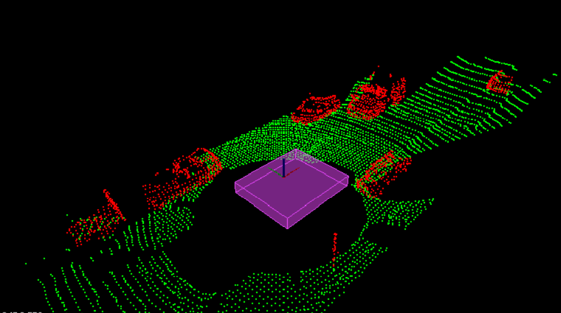
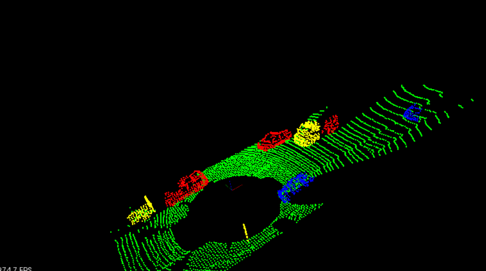
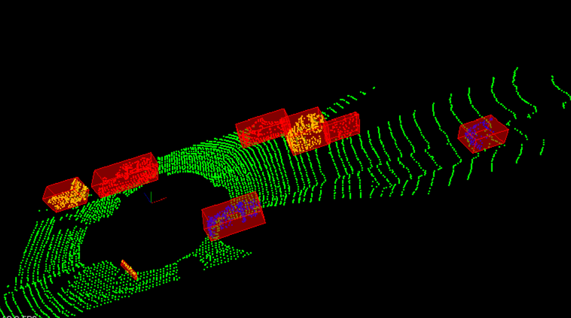

# Sensor Fusion Self-Driving Car Course

<!--  -->


**Lidar** sensing gives us high resolution data by sending out thousands of laser signals. These lasers bounce off objects, returning to the sensor where we can then determine how far away objects are by timing how long it takes for the signal to return. Also we can tell a little bit about the object that was hit by measuring the intensity of the returned signal. Each laser ray is in the infrared spectrum, and is sent out at many different angles, usually in a 360 degree range. While lidar sensors gives us very high accurate models for the world around us in 3D, they are currently very expensive, upwards of $60,000 for a standard unit.

## Project Details

This project detects road obstacles present in the point cloud data stream (LiDAR data) and builds a 3D bounding box around it. The entire LiDAR obstacle detection pipeline is divided into the three steps. 

The three steps are, \

**1. Segmentation** \
    Segmentation is used to segment the point cloud data into two different parts mainly the road and the obstacles. We see the road is a plane(inliers) and obstacles(outliers) are objects on the plane. I used RANSAC to identify the inliers and outliers point clouds. RANSAC allows to fit a plane where most of the points lie, using this principle, the points lying on the road plane is segmented from the obstacle. 
    The output from the segmentation is below. 



**2. Clustering** \
Clustering involves grouping the outliers point cloud i.e. point cloud corresponding to the obstacles. I used Euclidean Clustering (KDTree) method to group the points together if they fall into a group with a threshold distance. 

The image below shows the clusters in cycled colors of red, yellow, and blue. In that image we see that the oncoming truck is actually broken up into two colors, front and back. This illustrates the challenges with clustering based on proximity, the gap between the front of the truck and the back of the truck is large enough so that they look separate. 



**3. Bounding Box for the Cluster** \
This step involves placing a bounding box around the individual clusters formed by the clustering algorithm. 



## Installation

### Ubuntu 

```
$> sudo apt install libpcl-dev
$> cd ~
$> git clone https://github.com/udacity/SFND_Lidar_Obstacle_Detection.git
$> cd SFND_Lidar_Obstacle_Detection
$> mkdir build && cd build
$> cmake ..
$> make
$> ./environment
```

Install PCL, C++

The link here is very helpful, 
https://larrylisky.com/2014/03/03/installing-pcl-on-ubuntu/

A few updates to the instructions above were needed.

* libvtk needed to be updated to libvtk6-dev instead of (libvtk5-dev). The linker was having trouble locating libvtk5-dev while building, but this might not be a problem for everyone.

* BUILD_visualization needed to be manually turned on, this link shows you how to do that,
http://www.pointclouds.org/documentation/tutorials/building_pcl.php

